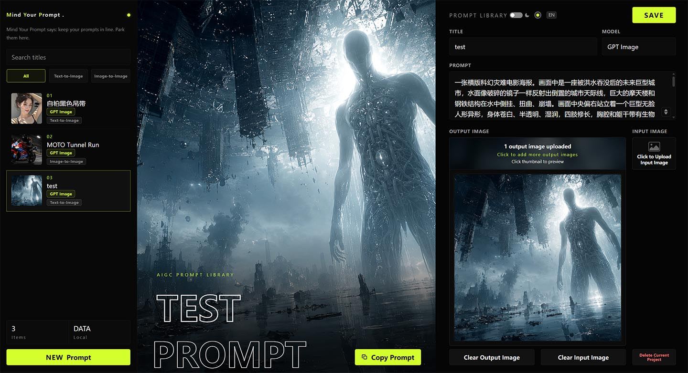

# Mind Your Prompt / MYP

Mind Your Prompt / MYP 是一个面向 AIGC 图片工作流的本地优先提示词管理工具。



MYP 的定位是一个轻量 Windows 文件夹工具：用浏览器打开界面，把提示词、模型名、原图和生成图保存在本地，并且可以通过复制 `DATA` 文件夹完成备份迁移。

## 特性

- 本地优先：通过本地服务启动时，数据保存在项目目录内。
- 浏览器前端：原生 HTML、CSS、JavaScript。
- 不使用 Electron、Node.js、npm、Vite、Webpack、React、Vue、Svelte。
- 不需要账号，不做云同步，不提供远程上传后端，不发起外部字体请求。
- 支持标题、模型名、提示词、Input Image 原图、Output Image 生成图管理。
- 支持搜索、文生图/图生图筛选、图片预览 lightbox、图片下载、复制提示词。
- 支持深浅主题切换、强调色切换、中英文切换。
- 支持复制 `DATA` 文件夹备份和迁移。
- 直接打开 `index.html` 时保留 IndexedDB 降级存储。

## Windows 环境要求

- Windows 10 或 Windows 11。
- 系统自带 Windows PowerShell 5.x。
- Edge、Chrome、Firefox 等现代浏览器。

## 启动方式

### 1. 可选启动器：双击 `Start MYP.exe`

- `Start MYP.exe` 是 Release 包里的便捷启动器，不是必需运行项。
- 会自动打开本地浏览器前端。
- 会启动本地 PowerShell 服务，但不会停留可见控制台窗口。
- 首次运行可能出现 Windows SmartScreen 提示，因为该 EXE 未签名。

如果你不信任未签名 EXE，可以删除 `Start MYP.exe`，改用下面的纯脚本启动方式。

### 2. 纯脚本启动：双击 `launch/Start_MYP.bat`

- 不运行 EXE 启动器。
- 启动同一个本地 PowerShell 服务。
- 自动打开浏览器。
- 项目移动目录后仍可使用，路径包含空格也可以正常启动。

### 3. 手动 PowerShell 启动

在项目根目录运行：

```powershell
powershell.exe -ExecutionPolicy Bypass -NoProfile -File .\server\MYP.ps1
```

浏览器会打开类似下面的本地页面：

```txt
http://127.0.0.1:47350/
```

## Windows SmartScreen 提示

`Start MYP.exe` 是未签名的可选启动器。首次运行时，Windows 可能会弹出 SmartScreen / Windows Defender 提示。

MYP 不依赖 EXE 启动器。你可以删除 `Start MYP.exe`，改用下面的纯脚本方式启动：

```powershell
launch\Start_MYP.bat
```

## 本地服务生命周期

- 本地服务只监听 `127.0.0.1`。
- 不开机自启。
- 不注册 Windows 服务。
- 不创建计划任务。
- 使用结束后不常驻后台。
- 页面打开期间，前端每 5 秒请求 `/api/health` 保活。
- 关闭 MYP 对应浏览器标签页后，本地服务会在约 20 秒空闲后自动退出。
- 如果 MYP 已经在运行，再次启动会直接打开已有端口页面，不会重复启动多个服务。
- `RUNTIME/` 会在运行时自动创建，用于临时保存 `server.log` 和 `server.port`。

## 数据位置

通过 `Start MYP.exe` 或 `launch/Start_MYP.bat` 启动时，用户数据保存在：

```txt
DATA/prompts.json
DATA/images/
```

如果 `DATA/prompts.json` 不存在，本地服务会自动创建内容为 `[]` 的文件。

上传图片会使用唯一文件名保存，避免同名图片互相覆盖。支持 80 MB 以内的 JPG/JPEG/PNG 图片。旧数据里的 `images/xxx.jpg` 路径仍然可以读取。

## 备份和迁移

备份时，直接复制整个 `DATA` 文件夹。

迁移到另一份 MYP 项目时，把备份的 `DATA` 文件夹覆盖到新项目根目录，再启动 MYP 即可恢复标题、模型名、提示词、原图、生成图和图片记录。

干净发布包里只保留这些占位文件：

```txt
DATA/.gitkeep
DATA/images/.gitkeep
```

用户记录和用户图片不会放进干净发布包。

## 直接打开 `index.html`

可以直接用浏览器打开 `index.html`。此时本地服务会显示离线，数据会保存到浏览器 IndexedDB。

浏览器 IndexedDB 存储不会跟随 `DATA` 文件夹一起迁移。

## 项目结构

```txt
MYP/
├─ index.html
├─ assets/
│  ├─ css/style.css
│  ├─ js/app.js
│  ├─ js/canvas-freeze.js
│  └─ icons/favicon.png
├─ docs/screenshot.jpg
├─ Start MYP.exe
├─ MYP.ps1
├─ server/MYP.ps1
├─ launch/
│  ├─ Start_MYP.bat
│  └─ start_silent.vbs
├─ DATA/
│  ├─ .gitkeep
│  └─ images/.gitkeep
├─ README.md
├─ README.zh-CN.md
├─ CHANGELOG.md
├─ LICENSE
└─ .gitignore
```

`RUNTIME/` 不进入版本追踪，运行时会自动创建。

## 开发者说明

前端保持原生 HTML/CSS/JS，不需要构建步骤。

PowerShell 本地服务提供：

- `GET /`
- `GET /assets/...`
- `GET /favicon.ico`
- `GET /api/health`
- `GET /api/prompts`
- `POST /api/prompts`
- `POST /api/image`
- `POST /api/delete-image`
- `POST /api/shutdown`
- `GET /data/images/...`

临时运行文件放在 `RUNTIME/`。用户数据放在 `DATA/`。

## License

MIT License，见 [LICENSE](LICENSE)。
